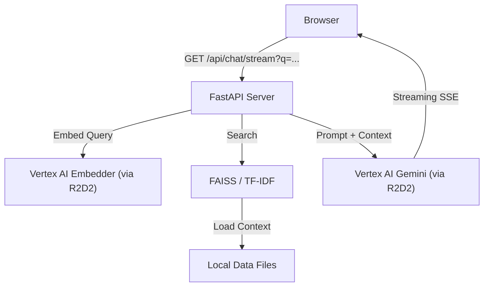

# RAG PoC Architecture

This document outlines the design and flow of the high-performance Informational RAG system.

## 1. High-Level Architecture

The system is designed as a **decoupled retrieval and generation pipeline** that prioritizes enterprise security (via R2D2/Helix) and low latency (via SSE streaming).



## 2. Component Design

### Frontend (UI/Vanilla JS)
- **Standalone**: A single `index.html` file using native Browser APIs (`EventSource`, `fetch`).
- **Low Overhead**: Zero build step, zero Node.js requirement.
- **Streaming Response**: Listens for `token` events from the backend to display text immediately.

### Backend (FastAPI)
- **Shared R2D2 Client**: A singleton factory that manages Helix authentication tokens, automatically refreshing them every 45 minutes or on 401 errors.
- **Adaptive Embedding**: The `VertexEmbedder` uses `text-embedding-005` with batching logic. If a batch fails, it automatically falls back to sequential embedding requests.
- **Pluggable Retrieval**: 
  - **FAISS**: Primary vector search for high-speed similarity.
  - **TF-IDF**: Local fallback if vector search is unavailable or un-indexed.

## 3. Data Flow

1. **Ingestion**: `ingest_docs.py` parses raw documents and stores extraction in `data/interim/`.
2. **Indexing**: `build_index.py` fetches Vertex embeddings for all chunks and builds a local FAISS index.
3. **Querying**: 
   - User question is embedded via Vertex.
   - FAISS identifies the top $K$ most relevant text blocks.
   - A system prompt is constructed containing only those blocks.
   - Vertex AI streams the answer back through the SSE connection.

## 4. Security & Authentication
- **Helix**: Used to obtain ephemeral access tokens from the local machine.
- **R2D2**: All Google Cloud traffic (Vertex AI) is routed through enterprise R2D2 gateways.
- **PII Protection**: Structured logging with redaction identifies and masks sensitive patterns.
```

-----------------------------------------------------------------------
*Note: For setup instructions, please refer to [README.md](README.md).*
