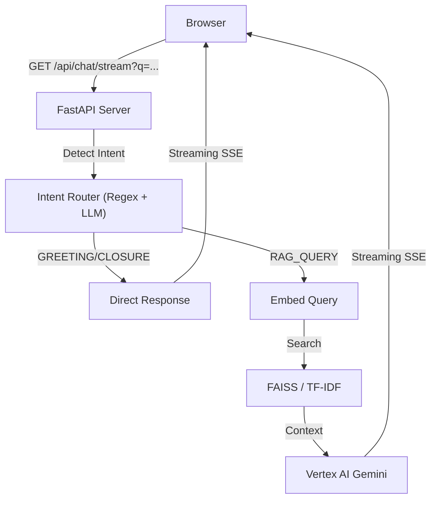
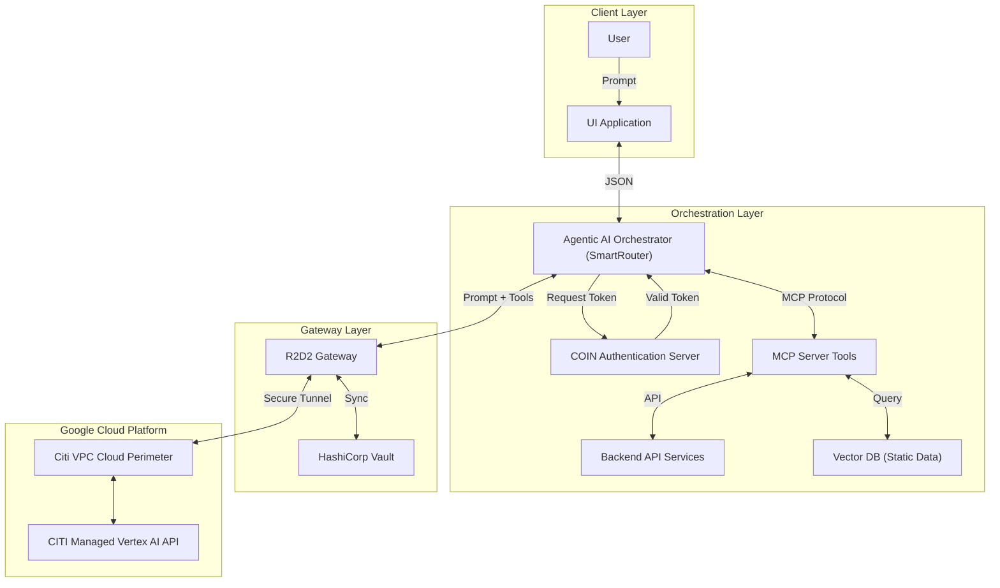

# RAG PoC Architecture

This document outlines the design and flow of the high-performance Informational RAG system.

## 1. High-Level Architecture

The system is designed as a **decoupled retrieval and generation pipeline** that prioritizes enterprise security (via R2D2/Helix) and low latency (via SSE streaming).

## 2. Component Design

### Frontend (UI/Vanilla JS)
- **Standalone**: A single `index.html` file using native Browser APIs.
- **Intent Visualization**: Displays detected intent tags (e.g., `INTENT: GREETING`) for transparency.
- **Streaming Response**: Real-time token display via Server-Sent Events (SSE).

### Backend (FastAPI)
- **Intent Router**: A dual-layer classification system. uses high-speed Regex for common patterns (Hi, Bye, Thanks) and Vertex AI for complex intent detection.
- **Shared R2D2 Client**: A singleton factory for Helix-authenticated Vertex AI access.
- **Pluggable Retrieval**: 
  - **FAISS**: Primary vector search.
  - **TF-IDF**: Local fallback for environments without vector indices.

## 3. Data Flow

1. **Ingestion**: `tools/ingest_docs.py` parses raw documents (`.pdf`, `.docx`, `.html`, `.pptx`) from `data/source/user` and `data/source/developer`.
2. **Indexing**: `tools/build_index.py` creates separate vector/TF-IDF indices for each corpus.
3. **Querying**: 
   - **Step 1: Intent**: User question is classified in `llm/intent_router.py`.
   - **Step 2: Logic**: 
     - If Greeting/Closure: Response via `llm/vertex_stream.py`.
     - If Search: Context retrieved via `llm/retrieval/`.
   - **Step 3: Streaming**: Vertex AI streams the answer back.

## 4. Security & Authentication
- **Helix**: Used to obtain ephemeral access tokens.
- **R2D2**: Routes all Vertex AI traffic through enterprise gateways.
- **Redaction**: Structured logging with PII masking.

## 5. Future Architecture (Roadmap)

The following schematic outlines the planned evolution towards a **Hybrid Agentic Architecture**:

-----------------------------------------------------------------------
*Note: For setup instructions, please refer to [README.md](README.md).*
