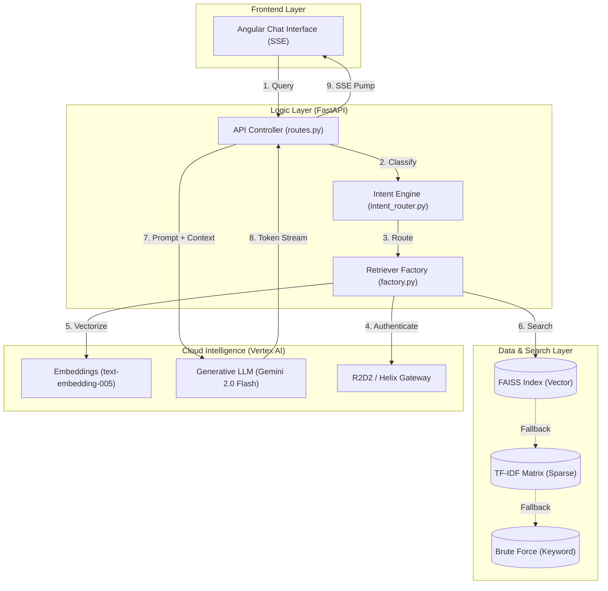

# Technical Walkthrough: GenAI RAG PoC

Welcome to the **GenAI RAG (Retrieval-Augmented Generation) Proof of Concept**. This document provides an in-depth technical breakdown of the application, its architecture, and the sophisticated engineering behind its retrieval and generation engine.

---

## 🚀 Key Capabilities

*   **Hybrid Intent Engine**: Automatically classifies user queries into **Greetings**, **Closures**, **Off-Topic**, or **RAG Queries** to ensure context-aware responses.
*   **Multi-Corpus Support**: Seamlessly switches between "User" and "Developer" knowledge bases, applying distinct personas (friendly vs. technical) and querying separate vector indices.
*   **Adaptive Retrieval Factory**: A multi-tiered search engine that selects the correct index based on the active corpus and falls back gracefully to TF-IDF if needed.
*   **Enterprise Security Gateway**: Native integration with **R2D2** and **Helix** for audited, governed access to Google Vertex AI.
*   **Streaming Intelligence**: Utilizes **Server-Sent Events (SSE)** to stream LLM responses token-by-token for a modern, responsive chat experience.
*   **Extractive Fallback Mode**: Can operate in a "Zero-LLM" mode where it extracts and formats high-relevance source chunks directly from documents without generative synthesis.
*   **Privacy-First Logging**: Built-in JSON logging with automatic PII and sensitive token redaction (PII/Credential masking).
*   **Multi-Source Ingestion**: Unified pipeline for parsing and vectorizing `.pdf`, `.docx`, and `.html` technical documentation.

---

## 🏗️ System Architecture

The application is built on a modular, asynchronous architecture designed for high-performance document retrieval and intelligent response generation.

### 🧩 High-Level Architecture Diagram

---

## 🔄 The Request Lifecycle (10 Steps)

Every user interaction follows a strictly governed lifecycle:

1.  **Entry**: User submits a query via the Chat UI, selecting a **Corpus** (User vs. Dev).
2.  **Intent analysis**: `IntentRouter` classifies the request. If it's a "Greeting", the system bypasses retrieval.
3.  **Auth Handshake**: `VertexR2D2Client` fetches a fresh **Helix token** and prepares the **R2D2** headers.
4.  **Vectorization**: The query is sent to Vertex AI's `text-embedding-005` to generate a 768-dimension vector.
5.  **Retrieval Routing**: The `RetrieverFactory` uses the `corpus` tag to load the specific FAISS index (`faiss_user.index` or `faiss_dev.index`).
6.  **Fallback Check**: If FAISS fails, the system switches to the corpus-specific TF-IDF model.
7.  **Context Construction**: Top $K$ chunks (default 5) are assembled into a structured context block.
8.  **Prompt Engineering**: A tailored system instruction (Friendly/Conversational or Technical/Precise) is selected based on the active corpus.
9.  **Generative Inference**: The prompt is processed by `Gemini 2.0 Flash`, which generates an answer grounded strictly in the context.
10. **SSE Delivery**: Tokens are streamed back to the frontend.

---

## 🛠️ Technical Deep Dive

### 1. Adaptive Retrieval Strategy
The system uses a **Priority Fallback Chain**:
*   **Tier 1: FAISS (Semantic)**: Uses L2 distance or Cosine similarity on embeddings for deep meaning-based search.
*   **Tier 2: TF-IDF (Keyword)**: Statistical keyword weighting for when the vector index is unavailable.
*   **Tier 3: Brute Force (Literal)**: Basic regex/substring matching as a final safety net.

### 2. Secure Connectivity Logic
The `VertexR2D2Client` acts as a specialized singleton:
*   **Token Refresh**: Automatically handles 401/403 errors by invoking the Helix command line to rotate security credentials.
*   **R2D2 Header Injection**: Ensures the `x-r2d2-soeid` is present in every request for enterprise auditing.
*   **SSL Handling**: Dynamically respects `SSL_CERT_FILE` environment variables for corporate proxy certificates.

### 3. Data Ingestion Pipeline
*   **Cleaner**: Strips noise from HTML and extracts pure text from PDFs/Word docs.
*   **Chunker**: Uses an overlapping window strategy (e.g., 1000 chars with 200 overlap) to preserve semantic context across chunk boundaries.
*   **Indexer**: Batches documents for efficient embedding generation and FAISS index construction.

---

## 🔒 Security & Observability

*   **Redaction Filter**: All logs are intercepted by a redactor that masks:
    *   Email addresses
    *   Phone numbers
    *   Bearer tokens and credentials
*   **Structured Logging**: Outputs JSON formatted logs for easy ingestion into enterprise monitoring tools like Splunk or ELK.
*   **Metadata Citations**: Every answer includes unique citations at the bottom, ensuring transparency and linkability back to source docs.
