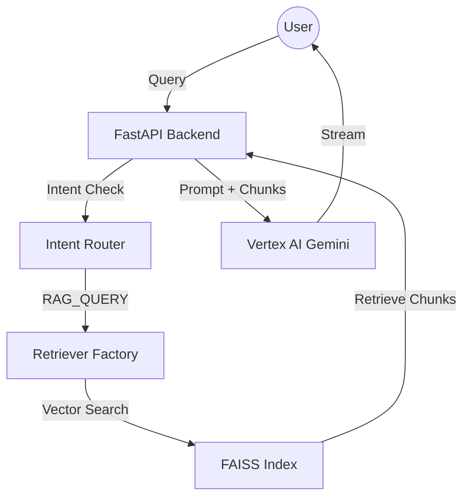

# Project Walkthrough: Informational RAG PoC

Welcome to the **Informational RAG (Retrieval-Augmented Generation) Proof of Concept**. This document serves as a comprehensive technical guide for new users and developers to understand the application's purpose, architecture, and inner workings.

---

## 1. What This Project Does

This application is a **domain-specific chatbot** that allows users to query their own technical documentation (PDFs, Word docs, HTML). It uses **Retrieval-Augmented Generation** to ensure that answers are grounded in provided facts rather than general LLM knowledge.

### Key Capabilities:
*   **Multi-Format Ingestion**: Automatically parses and chunks `.pdf`, `.docx`, and `.html` files.
*   **Semantic Search**: Uses Google Vertex AI embeddings and FAISS to find the most relevant document sections for any query.
*   **Intelligent Intent Routing**: Distinguishes between greetings, off-topic questions, and actual documentation queries.
*   **Streaming Responses**: Features a real-time Server-Sent Events (SSE) chat interface.
*   **Extractive Fallback (No-LLM Mode)**: Can operate as a pure search engine if the LLM is disabled, showing exactly what information was found in the sources.
*   **Enterprise-Ready Connectivity**: Integrates with corporate proxies/R2D2 via Vertex AI for secure, governed traffic.

---

## 2. Typical Use Cases

*   **Software Documentation Explorer**: Point it at a repo of tech specs or API docs to help devs find information quickly.
*   **Policy & Compliance Assistant**: Query HR policies or compliance handbooks with direct citations.
*   **Technical Support Bot**: Ground customer support answers in actual product manuals to prevent "hallucinations."

---

## 3. System Architecture

The project follows a modular, clean-code approach optimized for Dockerized deployment.

### Core Components:
*   **`main.py`**: The entry point. Handles server configuration and serves the static Chat UI.
*   **`api/`**: Contains the REST/SSE routes. This is the "brain" that coordinates between intent detection and retrieval.
*   **`llm/`**: The heart of the GenAI logic.
    *   `embeddings/`: Handles text vectorization for search.
    *   `retrieval/`: Implements the "Find" logic (FAISS, TF-IDF, Brute Force).
    *   `vertex_r2d2_client.py`: A centralized client that manages authentication (Helix) and R2D2 routing.
*   **`tools/`**: Standalone automation scripts for document ingestion and connectivity testing.
*   **`utils/`**: Shared helpers for logging (JSON format), redaction (PII/Token protection), and text chunking.

---

## 4. Technical Deep Dive

### Data Pipeline (The "Find" Stage)
1.  **Ingestion (`tools/ingest_docs.py`)**: Reads source files, strips formatting, and saves normalized text to `data/interim/`.
2.  **Indexing (`tools/build_index.py`)**:
    *   Chunks text into overlapping blocks (default 1000 characters).
    *   Generates 768-dimension vectors using Google's `text-embedding-005`.
    *   Builds a FAISS index for high-speed nearest-neighbor search.

### Retrieval Strategy
The application uses a **Factory Pattern** for retrieval. If the FAISS index is missing, it automatically falls back:
1.  **FAISS (Vertex AI)**: Highest accuracy, semantic understanding.
2.  **TF-IDF**: Keyword-based search (no LLM required).
3.  **Brute Force**: Simple keyword matching (absolute fallback).

### Response Generation (The "Show" Stage)
*   **Vertex Mode**: Sends a carefully crafted prompt to Gemini along with the top-3 retrieved chunks. The model is instructed to cite its sources explicitly.
*   **None Mode**: Skips the LLM entirely and formats the raw retrieved chunks into a readable "Extractive Insight" response with clear source headers.

---

## 5. Security & Governance

*   **Token Management**: Uses the `HELIX_TOKEN_CMD` to fetch ephemeral access tokens, ensuring no long-lived secrets are stored in code.
*   **R2D2 Routing**: All Vertex AI traffic is routed through R2D2 using the `x-r2d2-soeid` header for auditing and governance.
*   **Redaction**: The `utils/redaction.py` module automatically scrubs emails, phone numbers, and Bearer tokens from all application logs.

---

## 6. Getting Started

1.  **Check Connectivity**: Run `python tools/check_connection.py` to verify your environment can reach Vertex AI.
2.  **Build Index**: Place your docs in `data/source/`, then run `python tools/ingest_docs.py` followed by `python tools/build_index.py`.
3.  **Run**: Execute `python -m uvicorn main:app --reload` and visit `http://localhost:8000`.
