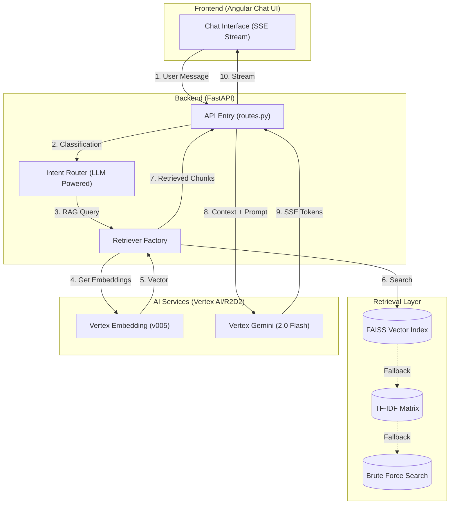

# Project Walkthrough: Informational RAG PoC

Welcome to the **Informational RAG (Retrieval-Augmented Generation) Proof of Concept**. This document serves as a comprehensive technical guide for new users and developers to understand the application's purpose, architecture, and request lifecycle.

---

## 1. System Architecture

The application is built on a modular, asynchronous architecture designed for high-performance document retrieval and intelligent response generation.

### 🧩 High-Level Architecture Diagram

---

## 2. Request Flow Lifecycle

Every user query goes through a standard **10-step lifecycle** to ensure accuracy and relevance:

1.  **Ingestion**: The user sends a query via the SSE-enabled Chat UI.
2.  **Intent Classification**: The `IntentRouter` uses Gemini 1.5 (or fast local rules) to determine if the query is a greeting, off-topic, or a document request.
3.  **Branching**: 
    *   If **Greeting/Off-Topic**: The system responds immediately with a pre-defined or LLM-generated polite message.
    *   If **RAG Query**: The system triggers the `RetrieverFactory`.
4.  **Embedding Generation**: The query is sent to Vertex AI's `text-embedding-005` to create a mathematical representation (vector).
5.  **Vector Search**: The system performs a similarity search in the local `FAISS` index to find the top $K$ most relevant document chunks.
6.  **Context Assembly**: The retrieved chunks are gathered and formatted into a structured context block.
7.  **Prompt Engineering**: A system instruction is combined with the context and the user query to guide the LLM's response.
8.  **Model Inference**: The prompt is sent to `Gemini 2.0 Flash` via the R2D2 secure gateway.
9.  **Token Streaming**: Gemini returns response tokens in real-time.
10. **Delivery**: The FastAPI backend pumps these tokens to the UI via Server-Sent Events (SSE) for a smooth typing effect.

---

## 3. Component Deep Dive

### 📂 Core Directory Structure

*   `main.py`: Entry point for uvicorn. Handles UI routing and static file serving.
*   `api/routes.py`: Core logic for managing the request lifecycle and SSE streams.
*   `llm/`: Centralized AI logic.
    *   `intent_router.py`: Determines the user's goal using a hybrid rule-based/LLM approach.
    *   `vertex_r2d2_client.py`: Singleton client managing Helix auth tokens and R2D2 routing.
*   `tools/`: Pipeline scripts for doc ingestion (`ingest_docs.py`) and index building (`build_index.py`).
*   `utils/`: 
    *   `redaction.py`: Automatically masques PII and tokens in logs.
    *   `text_chunker.py`: Logic for breaking large documents into retrievable segments.

---

## 4. Technical Use Cases

*   **Software Design Specs**: Query internal technical specifications with direct "Mode: None" extractive proof.
*   **Compliance Verification**: Quickly verify if a proposal meets documented compliance standards via RAG queries.
*   **Knowledge Base Search**: Acts as a smart search layer over unstructured PDF/Word manuals.

---

## 5. Security & Connectivity
*   **Secure Routing**: All traffic to Google Cloud is audited and gated by R2D2.
*   **Ephemeral Auth**: Helix tokens are fetched on-demand and cached for 45 minutes, meaning no permanent passwords exist on disk.
*   **JSON Logging**: Structured logs provide full observability with built-in redaction for sensitive enterprise data.
